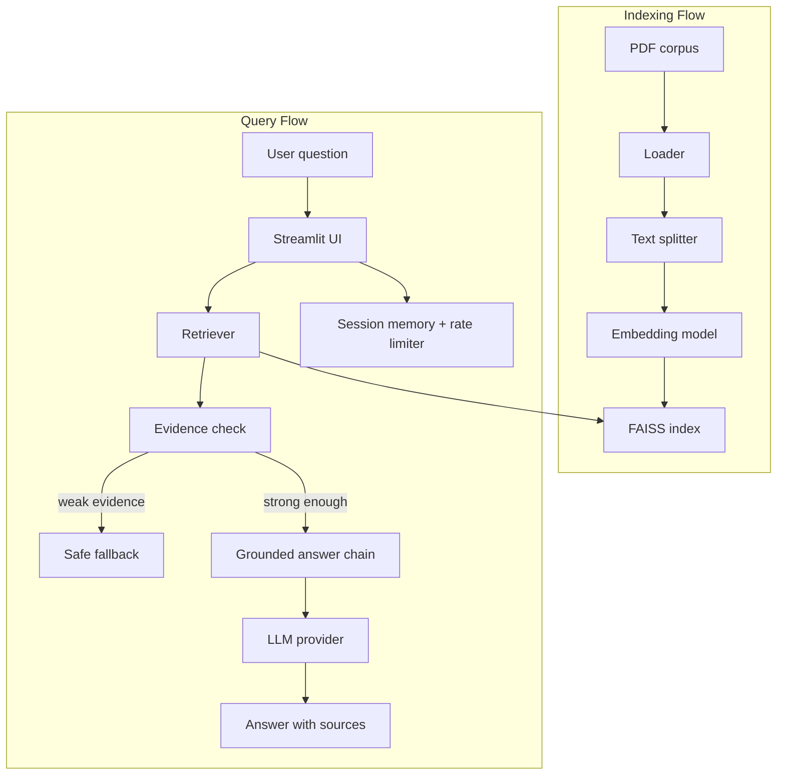

# AdAgent Copilot - Phase 1 RAG Chatbot

This repository contains a working phase 1 implementation of a document-grounded chatbot built with `Python + LangChain + RAG`.

Current capabilities:

- load a local PDF corpus from `data/corpus/knowledge_base/`
- split documents into chunks with configurable `chunk_size` and `chunk_overlap`
- generate embeddings with local `sentence-transformers` or `OpenAI`
- build and persist a local `FAISS` index under `data/indexes/faiss/knowledge_base/`
- reuse a valid persisted index through a manifest-based validity check
- retrieve relevant chunks with source metadata
- generate grounded answers through multiple provider adapters
- trigger safe fallback when retrieval evidence is missing or weak
- enforce a demo-level chat rate limit per session
- persist conversation history per user and session
- inspect indexing and retrieval from a `Streamlit` UI

## High-Level Architecture



More detail is in [docs/architecture/ARCHITECTURE.md](/Users/chperezpelaez/Documents/Github/dmc-tp2-chatbot/docs/architecture/ARCHITECTURE.md:1) and [docs/architecture/data_flow.md](/Users/chperezpelaez/Documents/Github/dmc-tp2-chatbot/docs/architecture/data_flow.md:1).

## Current Repository State

Implemented now:

- `Streamlit` demo in [app/streamlit_app.py](/Users/chperezpelaez/Documents/Github/dmc-tp2-chatbot/app/streamlit_app.py:1)
- indexing pipeline in [src/pipeline.py](/Users/chperezpelaez/Documents/Github/dmc-tp2-chatbot/src/pipeline.py:1)
- PDF loading, chunking, embedding factory, retrieval, FAISS persistence, and grounded answer chain in `src/`
- CLI helpers in `scripts/`
- technical documentation in `docs/`

Partially implemented or still documentation-first:

- automated evaluation suite with repeatable metrics
- broader guardrail policies beyond retrieval-strength fallback
- production deployment concerns

## Core Components

- `app/streamlit_app.py`: UI with `Indexing & Review` and `Chat`
- `src/chat/`: session memory, persistence, and rate limiting helpers
- `src/loaders/`: PDF ingestion
- `src/splitters/`: chunking
- `src/embeddings/`: embedding provider factory
- `src/vectorstores/`: FAISS build, load, manifest validity
- `src/retrievers/`: retrieval and evidence summary
- `src/chains/`: grounded answering and safe fallback
- `src/llms/`: provider adapters for `OpenAI`, `Qwen`, `Ollama`, and local Hugging Face chat models
- `scripts/index_knowledge_base.py`: build or refresh the local index
- `scripts/query_knowledge_base.py`: inspect retrieval results from the command line

## Guardrails

The current guardrail strategy is intentionally simple and retrieval-centered:

- answers are prompted to use only retrieved context
- if no chunks are retrieved, the system returns fallback
- if retrieved chunks exist but evidence is weak, the system also returns fallback
- evidence strength is currently based on:
  - maximum retrieved similarity
  - number of retrieved chunks above the configured similarity threshold
- chat requests are limited per session to reduce accidental API overuse

## Chat Experience

The current `Streamlit` chat experience includes:

- simple demo-level user registration through a `user name` field
- persistent conversation history stored under `data/conversations/`
- prompt memory from recent conversation turns
- `st.chat_message` and `st.chat_input` based UI instead of isolated one-off questions
- per-session rate limiting for chat submissions

Relevant files:

- [src/chains/grounded_qa.py](/Users/chperezpelaez/Documents/Github/dmc-tp2-chatbot/src/chains/grounded_qa.py:1)
- [src/retrievers/rag_retriever.py](/Users/chperezpelaez/Documents/Github/dmc-tp2-chatbot/src/retrievers/rag_retriever.py:1)
- [docs/specs/llm_prompts.md](/Users/chperezpelaez/Documents/Github/dmc-tp2-chatbot/docs/specs/llm_prompts.md:1)

## Evaluation

Acceptance scenarios are documented in [docs/evaluation/TEST.md](/Users/chperezpelaez/Documents/Github/dmc-tp2-chatbot/docs/evaluation/TEST.md:1).
The proposed metric design for this phase is documented in [docs/evaluation/LLM_EVALUATION.md](/Users/chperezpelaez/Documents/Github/dmc-tp2-chatbot/docs/evaluation/LLM_EVALUATION.md:1).

Recommended evaluation dimensions:

- retrieval quality: `hit@k`, `recall@k`, max similarity
- groundedness: answer faithfulness to retrieved passages
- source attribution accuracy
- fallback precision and recall
- repeated-prompt consistency

Runnable benchmark:

```bash
python scripts/evaluate_chatbot.py
```

## Run The App

Recommended environment: `Python 3.10+`

```bash
python3.11 -m venv .venv
source .venv/bin/activate
pip install -r requirements.txt
cp .env.example .env
streamlit run app/streamlit_app.py
```

Then open the local URL shown by `Streamlit`, usually `http://localhost:8501`.

## Provider Notes

Embeddings:

- default local embedding model: `BAAI/bge-m3`
- alternative local embedding model: `sentence-transformers/paraphrase-multilingual-MiniLM-L12-v2`
- optional API embedding model: `text-embedding-3-small`

Answering providers:

- `qwen` through DashScope-compatible API
- `openai`
- `ollama`
- local Hugging Face chat models

Provider configuration is documented in [docs/provider_configuration.md](/Users/chperezpelaez/Documents/Github/dmc-tp2-chatbot/docs/provider_configuration.md:1).

## Key Docs

- [docs/AGENTS.md](/Users/chperezpelaez/Documents/Github/dmc-tp2-chatbot/docs/AGENTS.md:1)
- [docs/steering/product.md](/Users/chperezpelaez/Documents/Github/dmc-tp2-chatbot/docs/steering/product.md:1)
- [docs/steering/scope.md](/Users/chperezpelaez/Documents/Github/dmc-tp2-chatbot/docs/steering/scope.md:1)
- [docs/steering/decisions.md](/Users/chperezpelaez/Documents/Github/dmc-tp2-chatbot/docs/steering/decisions.md:1)
- [docs/architecture/ARCHITECTURE.md](/Users/chperezpelaez/Documents/Github/dmc-tp2-chatbot/docs/architecture/ARCHITECTURE.md:1)
- [docs/specs/REQUIREMENTS.md](/Users/chperezpelaez/Documents/Github/dmc-tp2-chatbot/docs/specs/REQUIREMENTS.md:1)
- [docs/specs/llm_prompts.md](/Users/chperezpelaez/Documents/Github/dmc-tp2-chatbot/docs/specs/llm_prompts.md:1)
- [docs/evaluation/TEST.md](/Users/chperezpelaez/Documents/Github/dmc-tp2-chatbot/docs/evaluation/TEST.md:1)
