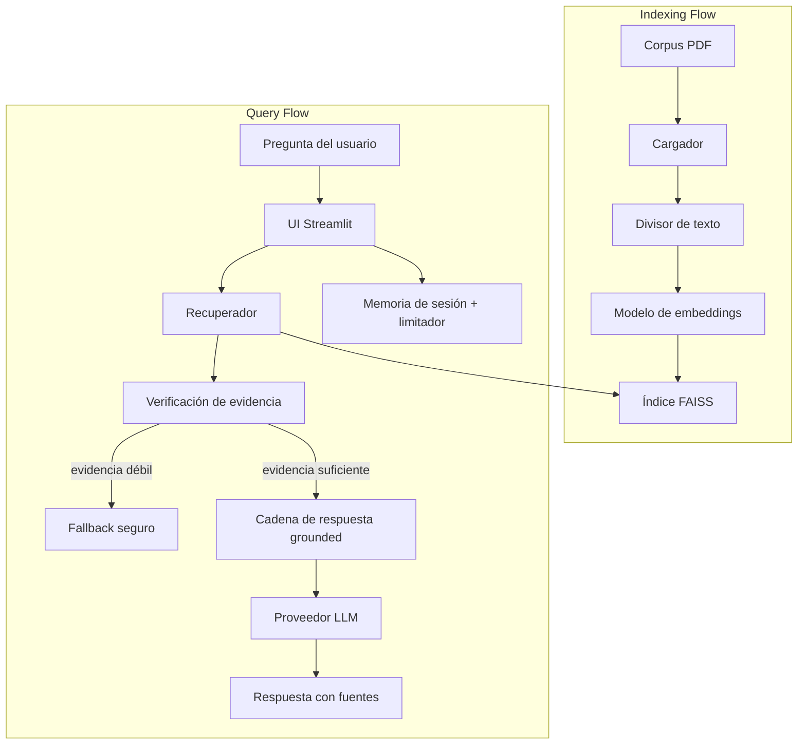

# AdAgent Copilot - Fase 1 Chatbot RAG

Este repositorio contiene una implementación funcional de la fase 1 de un chatbot grounded en documentos construido con `Python + LangChain + RAG`.

Para la guía de como instalar y correr el sistema vaya a: [Instalación y ejecución](#ejecutar-la-app)

Capacidades actuales:

- cargar un corpus local de PDFs desde `data/corpus/knowledge_base/`
- dividir documentos en chunks con `chunk_size` y `chunk_overlap` configurables
- generar embeddings con `sentence-transformers` local o `OpenAI`
- construir y persistir un índice local `FAISS` en `data/indexes/faiss/knowledge_base/`
- reutilizar un índice persistido válido mediante verificación con manifest
- recuperar chunks relevantes con metadatos de fuente
- generar respuestas grounded mediante múltiples adaptadores de proveedor
- activar un fallback seguro cuando la evidencia de retrieval es débil o inexistente
- aplicar límite de tasa de chat de nivel demo por sesión
- persistir el historial de conversación por usuario y sesión
- inspeccionar indexación y retrieval desde una UI de `Streamlit`

## Arquitectura de alto nivel



Más detalle está en [docs/architecture/ARCHITECTURE.md](docs/architecture/ARCHITECTURE.md) y [docs/architecture/data_flow.md](docs/architecture/data_flow.md).

## Estado actual del repositorio

Implementado ahora:

- demo de `Streamlit` en [app/streamlit_app.py](app/streamlit_app.py)
- pipeline de indexación en [src/pipeline.py](src/pipeline.py)
- carga de PDF, chunking, fábrica de embeddings, retrieval, persistencia FAISS y cadena de respuesta grounded en `src/`
- helpers de CLI en `scripts/`
- documentación técnica en `docs/`

Parcialmente implementado o todavía centrado en documentación:

- suite de evaluación automatizada con métricas reproducibles
- políticas de guardrail más amplias más allá del fallback por fuerza de retrieval
- preocupaciones de despliegue a producción

## Componentes principales

- `app/streamlit_app.py`: UI con `Indexing & Review` y `Chat`
- `src/chat/`: memoria de sesión, persistencia y helpers de limitación de tasa
- `src/loaders/`: ingestión de PDF
- `src/splitters/`: chunking
- `src/embeddings/`: fábrica de proveedores de embeddings
- `src/vectorstores/`: construcción, carga y validez de manifest de FAISS
- `src/retrievers/`: recuperación y resumen de evidencia
- `src/chains/`: respuesta grounded y fallback seguro
- `src/llms/`: adaptadores de proveedor para `OpenAI`, `Qwen`, `Ollama` y modelos chat locales de Hugging Face
- `scripts/index_knowledge_base.py`: construir o refrescar el índice local
- `scripts/query_knowledge_base.py`: inspeccionar resultados de retrieval desde la línea de comandos

## Guardrails

La estrategia actual de guardrails es intencionalmente simple y centrada en retrieval:

- las respuestas se piden que usen solo el contexto recuperado
- si no se recuperan chunks, el sistema devuelve fallback
- si hay chunks recuperados pero la evidencia es débil, también devuelve fallback
- la fuerza de la evidencia se basa actualmente en:
  - similitud máxima recuperada
  - número de chunks recuperados por encima del umbral de similitud configurado
- las solicitudes de chat se limitan por sesión para reducir el uso accidental de la API

## Experiencia de chat

La experiencia actual de chat en `Streamlit` incluye:

- registro simple a nivel demo mediante un campo `user name`
- historial de conversación persistente almacenado en `data/conversations/`
- memoria de prompt de los turnos recientes de conversación
- UI basada en `st.chat_message` y `st.chat_input` en lugar de preguntas aisladas
- limitación de tasa por sesión para envíos de chat

Archivos relevantes:

- [src/chains/grounded_qa.py](src/chains/grounded_qa.py)
- [src/retrievers/rag_retriever.py](src/retrievers/rag_retriever.py)
- [docs/specs/llm_prompts.md](/Users/chperezpelaez/Documents/Github/dmc-tp2-chatbot/_prompts.md)

## Evaluación

Los escenarios de aceptación están documentados en [docs/evaluation/TEST.md](docs/evaluation/TEST.md).
El diseño propuesto de métricas para esta fase está documentado en [docs/evaluation/LLM_EVALUATION.md](docs/evaluation/LLM_EVALUATION.md).

Dimensiones de evaluación recomendadas:

- calidad de retrieval: `hit@k`, `recall@k`, similitud máxima
- groundedness: fidelidad de la respuesta a los pasajes recuperados
- precisión de atribución de fuentes
- precisión y recall de fallback
- consistencia con prompts repetidos

Benchmark ejecutable:

```bash
python scripts/evaluate_chatbot.py
```

## Ejecutar la app

Entorno recomendado: `Python 3.10+`

### 1. Crear el entorno virtual

Windows PowerShell:

```powershell
python -m venv .venv
.\.venv\Scripts\Activate.ps1
python -m pip install --upgrade pip
pip install -r requirements.txt
```

macOS o Linux:

```bash
python3.11 -m venv .venv
source .venv/bin/activate
python -m pip install --upgrade pip
pip install -r requirements.txt
```

### 2. Configurar variables de entorno

Copie el ejemplo:

```bash
cp .env.example .env
```

En Windows PowerShell:

```powershell
Copy-Item .env.example .env
```

Edite `.env` según los proveedores que necesite. Ejemplo:

```text
HF_TOKEN=
QWEN_API_KEY=
DASHSCOPE_API_KEY=
QWEN_BASE_URL=https://dashscope-intl.aliyuncs.com/compatible-mode/v1
OPENAI_API_KEY=
OLLAMA_BASE_URL=http://localhost:11434
```

### 3. Generar o actualizar el índice

```bash
python scripts/index_knowledge_base.py --force
```

Opcional:

```bash
python scripts/index_knowledge_base.py --force --chunk-size 800 --chunk-overlap 120
```

### 4. Probar retrieval desde la CLI

```bash
python scripts/query_knowledge_base.py "¿Qué canal recomiendan para brand awareness?" --top-k 3
```

### 5. Ejecutar la app Streamlit

```bash
streamlit run app/streamlit_app.py
```

Abra la URL local que indique Streamlit, normalmente `http://localhost:8501`.

### Flujo recomendado

1. Use `Indexing & Review` para preparar el corpus y construir o cargar el índice.
2. Seleccione proveedor y modelo de embeddings.
3. Verifique que los PDFs se carguen correctamente.
4. Construya o cargue el índice FAISS.
5. Cambie a `Chat`, seleccione proveedor y modelo de respuesta.
6. Haga preguntas y revise las respuestas con sus fuentes.

## Notas sobre proveedores

Embeddings:

- modelo local predeterminado de embeddings: `BAAI/bge-m3`
- modelo local alternativo de embeddings: `sentence-transformers/paraphrase-multilingual-MiniLM-L12-v2`
- modelo opcional de embeddings por API: `text-embedding-3-small`

Proveedores de respuesta:

- `qwen` a través de la API compatible con DashScope
- `openai`
- `ollama`
- modelos chat locales de Hugging Face

La configuración de proveedores está documentada en [docs/provider_configuration.md](docs/provider_configuration.md).

## Documentos clave

- [docs/AGENTS.md](docs\AGENTS.md)
- [docs/steering/product.md](docs/steering/product.md)
- [docs/steering/scope.md](docs/steering/scope.md)
- [docs/steering/decisions.md](docs/steering/decisions.md:1)
- [docs/architecture/ARCHITECTURE.md](docs/architecture/ARCHITECTURE.md)
- [docs/specs/REQUIREMENTS.md](docs/specs/REQUIREMENTS.md)
- [docs/specs/llm_prompts.md](docs/specs/llm_prompts.md:1)
- [docs/evaluation/TEST.md](docs/evaluation/TEST.md)
