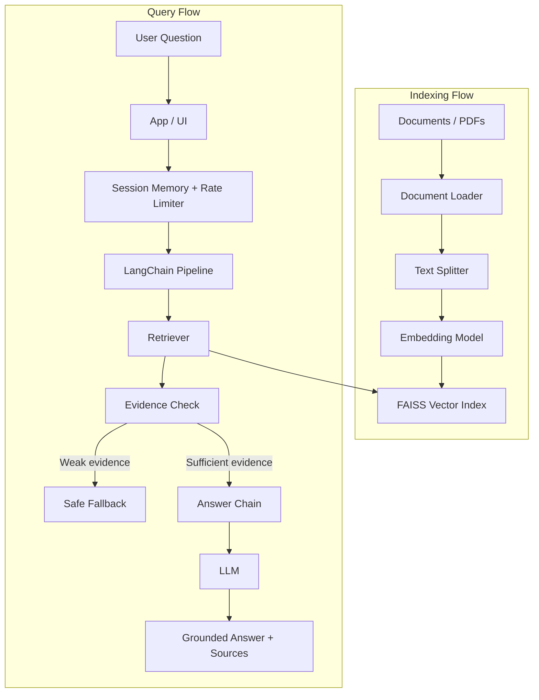

# System Architecture

## Main Flow

`User -> App/UI -> LangChain Pipeline -> Retriever -> LLM -> Answer`

## Diagram

## Step-By-Step Flow

1. Source documents are loaded and normalized into LangChain document objects when a new indexing run is needed.
2. Documents are split into chunks that preserve enough local context for retrieval.
3. Chunks are embedded and stored in a local `FAISS` index with source metadata.
4. If a valid persisted index already exists, the app should load and reuse it instead of rebuilding everything from zero.
5. A user sends a question through the demo interface.
6. The chat layer applies session memory and a demo-level rate limit before provider calls.
7. The LangChain pipeline retrieves the most relevant chunks from `FAISS`.
8. The pipeline checks whether retrieved evidence is strong enough for grounded answering.
9. If evidence is weak or missing, the system should return a bounded fallback instead of guessing.
10. If evidence is sufficient, the answer chain builds a grounded prompt with the user query, recent conversation state, and retrieved context.
11. The LLM generates the final answer, ideally including source-aware traceability.

## Core Subsystems

### Document Loader

- reads files from a defined source directory or file list
- assumes a local corpus folder as the primary source strategy for phase 1
- converts supported files into LangChain document objects
- preserves source metadata for later citation and debugging

### Text Splitter

- breaks large documents into retrieval-sized chunks
- keeps enough overlap to preserve local meaning across chunk boundaries
- attaches chunk metadata for traceability

### Embedding Model

- converts chunks and queries into vector representations
- can use API-based providers such as `OpenAI`
- can use local providers such as `sentence-transformers`
- must remain configurable without changing the high-level architecture
- changing the embedding provider or model should be treated as an index-changing event

### Vector Index

- stores chunk embeddings for semantic search
- uses `FAISS` as the current vector store for phase 1
- should persist index artifacts under a local project folder
- supports repeated queries after indexing
- retains metadata needed for source-aware answers

### Retriever

- receives the user query
- finds the most relevant chunks from the vector index
- returns ranked context for answer generation

### Evidence Check

- evaluates whether retrieval results are strong enough to justify answer generation
- should consider similarity score and the number of supporting chunks
- acts as a guardrail against answering from weak retrieval evidence

### Session Memory And Rate Limiter

- keeps recent user and assistant turns for the active chat session
- persists demo conversations by user and session id
- applies a local sliding-window limit before LLM generation calls
- improves UX without introducing production authentication complexity

### Answer Chain

- receives the user question plus retrieved context
- generates a grounded answer through `LangChain`
- should call a provider-agnostic LLM layer instead of a hardcoded vendor implementation
- assumes `Qwen` as the default answering provider for phase 1
- should allow additional providers such as `OpenAI` without changing the retrieval architecture
- may use API-based or local providers depending on environment configuration
- should explicitly handle weak or missing evidence

### Demo Interface

- provides a simple way to run the chatbot end to end
- uses `Streamlit` as the main demo UI
- uses a `notebook` as the step-by-step review interface
- should expose two main panels: `Indexing & Review` and `Chat`
- should make the indexing and query path easy to demonstrate

### User-Editable Settings

`Indexing & Review` should expose:

- corpus folder or corpus selection
- embedding provider selection
- embedding model selection that updates based on the chosen embedding provider
- run indexing or reindexing
- `chunk_size`
- `chunk_overlap`
- `top_k` for retrieval inspection
- visibility of retrieved sources or chunks in the review UI

`Chat` should expose:

- answering provider selection from the configured available providers
- answering model selection that updates based on the chosen provider
- source visibility in the answer view

These settings should be limited to safe demo-facing controls.
Technical configuration such as API keys, internal paths, and provider defaults should remain outside the user-facing UI.
The recommended pattern is to collect these values in `Streamlit` and validate them through `Pydantic` models before running indexing or retrieval operations.
Available providers in the UI should depend on which API keys are configured in the environment.
The list of answering models should come from a curated application catalog, filtered by the selected provider.
The list of embedding models should come from a curated provider-to-model catalog, and local embedding options may be shown even when no API key is present.

## Architectural Principle

The system must separate:

- indexing-time work: load, split, embed, store
- query-time work: retrieve, ground, generate, answer

For the current phase, the `store` and `retrieve` steps are assumed to run on top of a local `FAISS` index for simplicity and demo reliability.
The recommended local layout is to keep source documents under `data/corpus/` and FAISS artifacts under `data/indexes/faiss/`.
Indexing should behave as a preparation workflow, not as a mandatory step on every app startup.
The LLM layer should remain provider-agnostic so the project can switch defaults or add vendors without redesigning the RAG pipeline.
Because the vector space depends on embeddings, any embedding-provider or embedding-model change should trigger reindexing.

## Phase Boundary

Advanced conversational orchestration, analytics layers, recommendation engines, and AdAgent-specific decision logic belong to later phases and must not shape the current system design.
