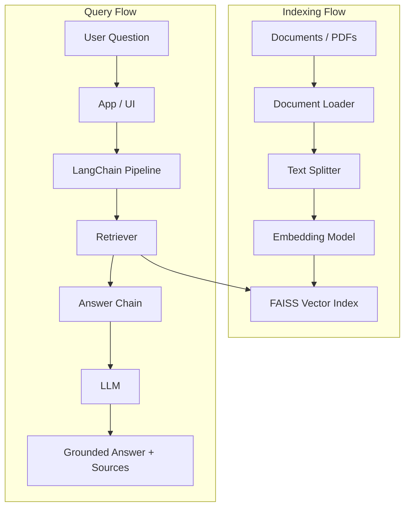

# System Architecture

## Main Flow

`User -> App/UI -> LangChain Pipeline -> Retriever -> LLM -> Answer`

## Diagram

## Step-By-Step Flow

1. Source documents are loaded and normalized into LangChain document objects.
2. Documents are split into chunks that preserve enough local context for retrieval.
3. Chunks are embedded and stored in a local `FAISS` index with source metadata.
4. A user sends a question through the demo interface.
5. The LangChain pipeline retrieves the most relevant chunks from `FAISS`.
6. The answer chain builds a grounded prompt with the user query plus retrieved context.
7. The LLM generates the final answer, ideally including source-aware traceability.

## Core Subsystems

### Document Loader

- reads files from a defined source directory or file list
- converts supported files into LangChain document objects
- preserves source metadata for later citation and debugging

### Text Splitter

- breaks large documents into retrieval-sized chunks
- keeps enough overlap to preserve local meaning across chunk boundaries
- attaches chunk metadata for traceability

### Embedding Model

- converts chunks and queries into vector representations
- can use OpenAI or HuggingFace-oriented providers
- must remain configurable without changing the high-level architecture

### Vector Index

- stores chunk embeddings for semantic search
- uses `FAISS` as the current vector store for phase 1
- supports repeated queries after indexing
- retains metadata needed for source-aware answers

### Retriever

- receives the user query
- finds the most relevant chunks from the vector index
- returns ranked context for answer generation

### Answer Chain

- receives the user question plus retrieved context
- generates a grounded answer through `LangChain`
- should explicitly handle weak or missing evidence

### Demo Interface

- provides a simple way to run the chatbot end to end
- can be CLI, notebook, or lightweight app UI
- should make the indexing and query path easy to demonstrate

## Architectural Principle

The system must separate:

- indexing-time work: load, split, embed, store
- query-time work: retrieve, ground, generate, answer

For the current phase, the `store` and `retrieve` steps are assumed to run on top of a local `FAISS` index for simplicity and demo reliability.

## Phase Boundary

Advanced conversational orchestration, analytics layers, recommendation engines, and AdAgent-specific decision logic belong to later phases and must not shape the current system design.
